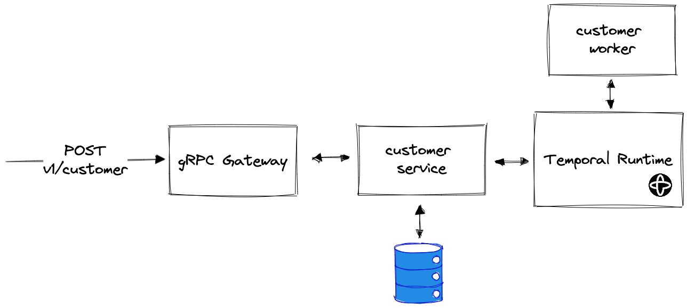
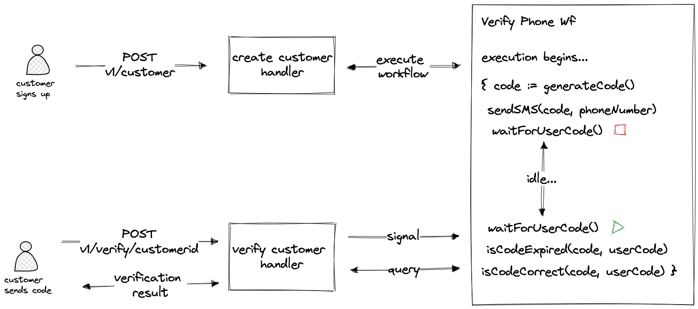

# Temporal Coffee Shop

This repository aims to demonstrate some of the features of the [Temporal](https://temporal.io) workflow engine and how it can alleviate some difficulties when developing distributed systems.

Specifically it aims to demonstrate the notion of "durable execution" an abstraction which allows preservation of application state without explicitly writing to a database. This abstraction is very powerful as it allows one to write business logic that can span multiple services or APIs, involve waiting for arbitrary amounts of time (hours, days, years!), can wait for user input all in a single function without worrying about partial failure states. Temporal provides this abstraction in the form of workflows - see the [Verification Workflow](internal/customer/workflows/verifyphone/workflow.go#L34) in this repo for an example.

## High Level Architecture and Flow



This repo accompanies this [blog post](), so it's recommended to read that first, however a simple explanation of the business logic implemented is outlined below.

We implement a workflow to verify an imaginary customer's phone number. Imagine a user has just signed up to our application. We send them an SMS with a one time code, which they must enter into our app to confirm they are the real owner of this phone number. This might seem like a simple thing to code at first, but doing so in a reliable and robust way can be more challenging that you think. What happens if our app crashes after sending the user the code or after receiving the code but before marking the user as verified? Which pieces of information do we need to save to our database and retrieve again to implement this logic? Temporal provides an abstraction known as a workflow where we don't have to handle these scenarios explicitly because of the properties afforded to use by the Temporal runtime, namely state tracking and persistence (durable execution) see the blog post for more details on how exactly this works.

## How to Run

In the root of this repository run `docker-compose up`\
Navigate to `localhost:8233` to view the Temporal UI

### Create a new customer

This will insert a new record into the DB and execute the VerifyPhoneWorkflow
This workflow will "send" an SMS with a code (really just prints a message) to the user and waits for them to send a response back.

```
curl --location 'http://localhost:8081/v1/customers' \
--header 'Content-Type: application/json' \
--data-raw '{
    "customer": {
        "first_name": "Test",
        "last_name": "Customer",
        "email": "test@gmail.com",
        "phone_number": "07500514"
    },
    "request_id": "34dd76a6-230a-41a2-b603-7b99aad15de8"
}'
```

### Verifying a Customer's Phone Number

This sends a signals to the workflow containing the code you submitted in the request which will then perform the comparison logic. The handler then queries the state of the workflow to retrieve the verification result, which is then sent in the response back to the caller.

> **Note** make sure to update the request path below to include the customer id, which is obtained from the response of the first request.

```
curl --location 'http://localhost:8081/v1/customers/<your-customer-id>:verify' \
--header 'Content-Type: application/json' \
--data '{
    "verification_code": "1233"
    <!-- set to 1234 to complete the flow successfully -->
}'
```

The correct code is set to `1234` by default.

The default expiry time is two minutes and the default value for the maximum number of allowed attempts is 3, after which the workflow will return with a terminal failure. These parameters can be modified [here](internal/customer/api/create.go#L36)

### Verifying durability in the face of failure

Let's take our server offline mid flow to prove Temporal is indeed persisting our workflow the state.

1. Create a customer, triggering the sending of the first SMS message
2. Make an incorrect verification attempt by sending an incorrect code
3. Make another incorrect verification attempt by sending another incorrect code (leaving us with only on attempt left)
4. Take our server offline with `docker-compose down`
5. Make final incorrect verification attempt which should result in a response containing: `VERIFICATION_RESULT_MAX_ATTEMPTS_REACHED`.

This proves that even despite our server crash, and not explicitly saving the number of attempts in our database that Temporal was able to utilise its "replay" feature to reconstruct the state and realises that two attempts had already been made prior!

The diagram below visualises the end to flow.


